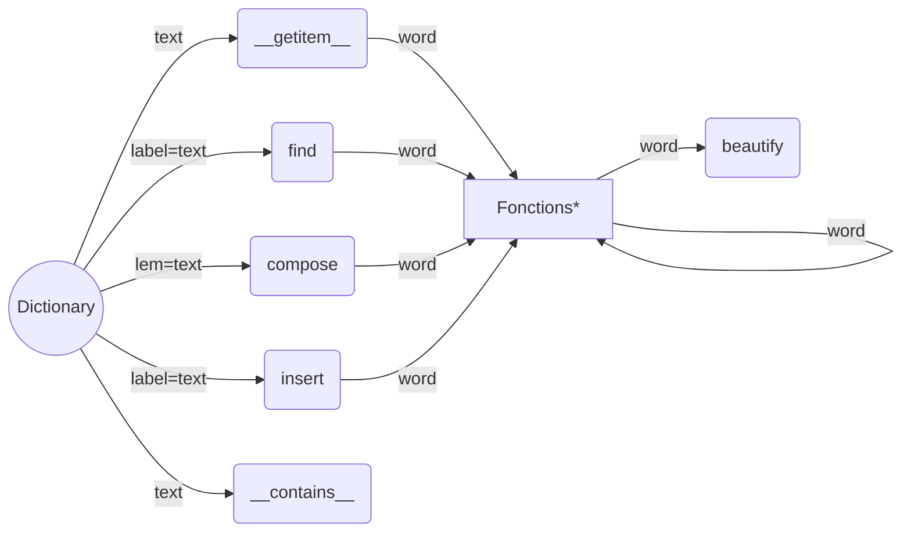

# Dictionary

- [Quickstart](#quickstart)
	- [Installation](#installation)
	- [Premier pas](#premier-pas)
	- [Chercher un élément](#search)
	- [Trouver une liste d'éléments](#find)
	- [Formuler un mot](#compose)
	- [Insérer un mot dans le dictionnaire](#insert)
	- [Savoir si un mot est connu](#contains)
- [Utilisation précommandé](#recommandations)
	- La structure d'un `word` (mot)
- [API Dictionary](#api)
- [Configuration](#config)
	- [Changer la configuration a l'exécution](#configexec)
- [Les codes](#codes)
- [Utilisation avancée](#advanced)

| :books: [Documentation]() |
| --- |

<h2 id="quickstart">Quickstart</h2>

<h3 id="installation">Installation</h3>

**Ouvrez un terminal** et entrez le code ci-dessous (sur **Windows** un *git bash* est recommandé):
```bash
    cd <your_repository>
    git clone http://git.spacink.xyz/VictoriaEngin/dictionary.git
```

<h3 id="premier-pas">Premier pas</h3>

**Commencez par importer** la `class Dictionary`, celle-ci va nous permettre d'effectuer les différentes actions décrite plus bas.
```python
    from dictionary import Dictionary
    
    # Crée une nouvelle instance for les prochaines étapes
    dictionary = Dictionary(
	    # path='dictionary'
    )
```
<h3 id="search">Chercher un élément (__getitem__)</h3>

Nous allons tenter de chercher un mot dans notre dictionnaire et afficher les informations sur celui-ci.

```python
    # Chercher un élément avec 'avoir' comme étiquette
    mot = dictionary['avoir']
    
    print(dictionary.beautify(mot))
```
##### Sortie

```python
{
   "label": "avoir",
   "type": "verbe",
   "lem": "avoir",
   "tags": "V+z1:W",
   "flexional": 
   [
      [ "infinitif" ]
   ],
   "semantic": 
   [
      "langage courant"
   ]
}
```

<h3 id="find">Trouver une liste d'éléments (find)</h3>

**Rechercher un mot** peut se faire de différentes manière.
La comparaison des mots se fait par son `label` et si le `type` est renseigné, celui-ci est également prit en compte.

```python
    # Chercher des éléments avec 'avoir' comme étiquette et de type 'verbe'
    mots = dictionary.find('avoir')
    
    print([dictionary.beautify(mot) for mot in mots])
```
##### Sortie

```python
[
  {
    "label": "avoir",
    "lem": "avoir",
    "tags": "V+z1:W",
    "flexional": [
      [
        "infinitif"
      ]
    ],
    "semantic": [
      "langage courant"
    ]
  },
  {
    "label": "avoir",
    "lem": "avoir",
    "tags": "N+z1:ms",
    "flexional": [
      [
        "masculin",
        "singulier"
      ]
    ],
    "semantic": [
      "langage courant"
    ]
  }
]
```

> **NOTE**
> La méthode pour chercher un élément vu précédemment (`__getitem__`) utilise celle-ci pour vous renvoyer un résultat.

<h3 id="compose">Formuler un mot (compose)</h3>

A partir de la **lemmatisation** d'un mot, il est possible de connaitre les différentes formes qu'un mot peut prendre, par exemple **trouver le féminin pluriel d'un mot**.

Ici nous allons tenter de **conjuguer** le verbe _avoir_:
```python
    resultat = dictionary.compose(
	    'avoir',
	    type='verbe'
	    flexional=[
		    'présent de l’indicatif',
		    '1st personne',
		    'singulier'
	    ]
    )
    
    print(resultat)
```
##### Sortie

```python
[
   {
      "label":"ai",
      "lem":"avoir",
      "tags":"V+z1:P1s",
      "flexional":[
         [
            "présent de l’indicatif",
            "1st personne",
            "singulier"
         ]
      ],
      "semantic":[
         "langage courant"
      ]
   }
]
```

<h3 id="contains">Savoir si un mot est connu (__contains__)</h3>

Il peut être utile parfois de savoir si un mot **est connu de notre dictionnaire** ou non.

L'exemple qui suit va vous aider a mieux comprendre :
```python
    print('avoir' in dictionary)
```
##### Sortie
```bash
    True
```

<h3 id="insert">Insérer un mot dans le dictionnaire (insert)</h3>

Pour clôturer cette introduction, nous allons nous intéresser a l'ajout de mots. Une opération qui vous sera très certainement utile pour étoffer vos dictionnaires ou dans d'autres cas d'utilisations.

Tentons d'insérer un mot avec quelques informations le concernant:
```python
    mot = dictionary.insert(
	    'zinzin',
	    type='adjectif'
	    semantic=[
		    'langage courant'
	    ]
	    sens=[{
		 'definition': "Ce dit d'une personne ayant un comportement se rapportant a de la stupidité",
		 'examples': [
			 "Il est complêtement zinzin lui"
		 ],
		 'synonyms': [
			 'fou', 'folle', 'bête'
		 ]   
	    }]
    )
```

> **NOTE**
> Qui dit ajout, dit suppression ?
> 
> En réalité, nous n'avons pas besoin de nous pré-occuper de ce facteur. Car, afin d'assurer des temps de traitement optimaux, la librairie gère la suppression de données inutilisées.
> 
> Néanmoins il reste possible de supprimer des éléments, nous verrons cela dans les [utilisations avancées.](avancedUsage.md#remove)
> 
> Plus bas nous verrons comment configurer notre dictionnaire selon [nos préférences.](#config)

<h2 id="recommandations">Utilisation précommandé</h2>



Ci-dessus un graphe représentant l'**ordre des actions possible**. Néanmoins cela ne reste qu'une schématisation simplifié.

***Fonctions:** Ensemble des fonctions qui compose la `class Dictionary` prenant un `word` en argument.

Liste des fonctions qui compris dans cet ensemble:
* get_infos_on
* update
* add_sens
* add_quote
* add_difficulty
* `__contains__`
* _insert_ (`**word`)
* _find_ (`**word`)

### Les attributs d'un `word` (mot)

* **word**:
	* **label**
	* **type** 
	* **lem**
	* **tags**
	* **flexional**
	* **semantic**
	* **sens**
		* definition
		* examples
		* synonyms
	* **homonyms**
	* **difficulties**
		* type
		* text
	* **quotes**
		* text
		* author
		* infos
		* infosAuthor
 
 Pour plus d'information, veuillez consulter la [documentation]().

<h2 id="api">API Dictionary</h2>

L'`API Dictionary` est un **service** en ligne externe utilisé pour récupérer des **informations sur internet** concernant un mot.

Celui-ci est intégré a la `class Dictionary` et par défaut contient un certain nombre d'informations en base de données recensées dans le tableau ci-dessous.

Intitulé | Données
 --- | ---
Nombre de mots a l'infinitif (**lemmatisation**) | 44 411 mots
Nombre de mots au **total** | 792 260 mots

<h2 id="config">Config</h2>

Intitulé | Nom de la variable | Valeur par défaut
--- | --- | ---
**Emplacement** des **données** | `DATABASE_PATH` | `/datas`
**Taille maximal** de données enregistré en base de donnée | `LOCAL_DICT_MAX_SIZE` | 5 Mb
**Minimum de mots** pouvant être sauvegardé | `LOCAL_DICT_MIN_COUNT` | 1 000 mots

<h3 id="configexec">Changer la configuration a l'exécution</h3>

```python
    from dictionary import Variables as settings
    
    # Setting max words that can be save
    settings.LOCAL_DICT_MIN_COUNT = 5000
```

> **ATTENTION !**
> Plus vous stockez des **quantités importante** en base de donnée et plus il a des chances qu'il se faille ressentir une certaine **latence**.

<h2 id="codes">Les codes (types, sémantiques, ...)</h2>

Section | Type | Lemmatisation | Sémantique | Flexionnel
--- | --- | --- | --- | ---
**Tag** | `type` | `lem` | `semantic` | `flexional`
**Codes** | `adjectif`<br />`adverbe`<br />`conjonction de coordination`<br />`conjonction de subordination`<br />`déterminant`<br />`interjection`<br />`nom`<br />`préposition`<br />`pronom`<br />`verbe` |  | `langage courant`<br />`langage spécialisé`<br />`abstrait`<br />`animal`<br />`animal collectif`<br />`concret`<br />`concret collectif`<br />`humain`<br />`humain collectif`<br />`verbe transitif`<br />`verbe intransitif`<br />`verbe pronominal`<br />... | `masculin`<br />`féminin`<br />`neutre`<br />`singulier`<br />`pluriel`<br />`1st personne`<br />`2nd personne`<br />`3rd personne`<br />`présent de l’indicatif`<br />`imparfait de l’indicatif`<br />`présent du subjonctif`<br />`imparfait du subjonctif`<br />`présent de l’impératif`<br />`présent du conditionnel`<br />`passé simple`<br />`infinitif`<br />`participe présent`<br />`participe passé`<br />`futur`


<br />Les codes utilisés sont les mêmes que ceux utilisé par [Unitex.](https://unitexgramlab.org/fr)

Pour plus d'information, veuillez consulter ce [document.](https://unitexgramlab.org/releases/3.2/man/Unitex-GramLab-3.2-usermanual-fr.pdf)

<h2 id="advanced">Utilisation avancée</h2>

Pour consulter des cas d'utilisation plus avancés, veuillez consulter ce [document.](advancedUsage.md)
